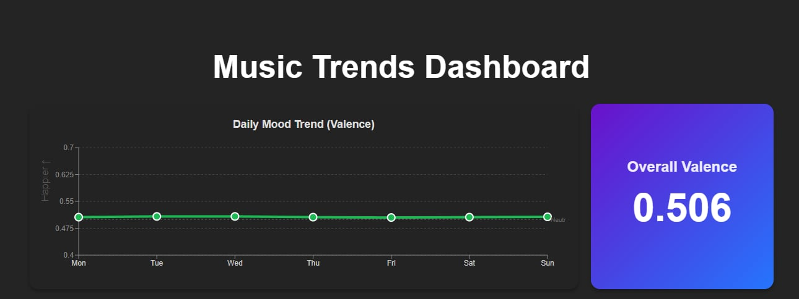

<div align="center">

#  Spotify Music Trends <br /> Analyzer
### A Full-Stack Data Visualization Dashboard

[](https://react.dev/)
[](https://fastapi.tiangolo.com/)
[](https://www.python.org/)
[](https://pandas.pydata.org/)

<br />



<br />

**A powerful analytics tool that processes 29,000+ songs to uncover the hidden patterns behind viral hits, listener moods, and track longevity.**

[Report Bug](https://github.com/ChassMiguel/Spotify-EDA-Dashboard/issues) · [Request Feature](https://github.com/ChassMiguel/Spotify-EDA-Dashboard/issues)

</div>

---

##  Key Features

| **Big Data Visualization** | **Viral Trend Engine** |
|:-----------------------------|:--------------------------|
| Efficiently renders insights from a **29k+ row dataset** using client-side sampling and `useMemo` hooks to prevent DOM crashes. | Calculates **Linear Regression** in real-time to mathematically prove that *Tempo (BPM)* has zero correlation with viral rank climbing. |

| **Mood Quantifier** | **The "Happy" Recipe** |
|:-----------------------|:--------------------------|
| Aggregates daily listening habits to visualize national emotional trends using Spotify's **Valence** metric. | A comparative analytics engine that breaks down the "DNA" of Happy vs. Sad songs (Energy, Danceability, Duration). |

---

## Repository Structure

```text
spotify-trends-analyzer/
├──  backend/              # Python FastAPI Server
│   ├──  app/
│   │   ├──  routers/      # API Route Handlers
│   │   │   ├── data.py      # Data fetching endpoints
│   │   │   └── __init__.py
│   │   ├── database.py      # DB Connection Logic
│   │   ├── main.py          # Application Entry Point
│   │   ├── models.py    # Pydantic/SQLAlchemy Models
│   │   └── schemas.py       # Data Validation Schemas
│   ├── .env                 # Environment Variables
│   └── requirements.txt     # Python Dependencies
├──  frontend/             # React Client
│   ├── src/
│   │   ├── components/      # Recharts Visualizations
│   │   ├── App.jsx          # Main Dashboard Layout
│   │   └── main.jsx         # Frontend Entry Point
│   └── package.json         # JS Dependencies
└── README.md
```

---

##  Quick Start

### 1. Clone the Repository
```bash
git clone https://github.com/ChassMiguel/spotify-trends-analyzer.git
cd spotify-trends-analyzer
```

### 2. Backend Setup (Python)
```bash
cd backend
python -m venv venv
source venv/bin/activate  # Windows: venv\Scripts\activate
pip install -r requirements.txt
uvicorn main:app --reload
```

### 3. Frontend Setup (React)
```bash
cd frontend
npm install
npm run dev
```

---

## Engineering Challenges Solved

> **Client-Side Statistical Analysis**
>
> *Challenge:* The raw dataset contained 29,000+ songs, but I needed to visualize complex relationships like proving the lack of correlation between Tempo and it's ability to be Viral without relying on heavy backend queries for every chart.
>
> *Solution:* Engineered a **custom analytics engine** within React. Instead of simple data fetching, the frontend implements **Linear Regression algorithms** (Least Squares) and dynamic **Data Aggregation** (grouping by Valence) in real-time using `useMemo`, allowing for instant statistical insights without server lag.

---

<div align="center">

Developed by

| **Chass Miguel E. Mesina** | **Margrette Sofia M. Hidalgo** |
| :---: | :---: |
| Fullstack Developer | Data Analyst |
| [](https://www.linkedin.com/in/chass-miguel-mesina) | [](https://www.linkedin.com/in/their-profile) |

</div>
